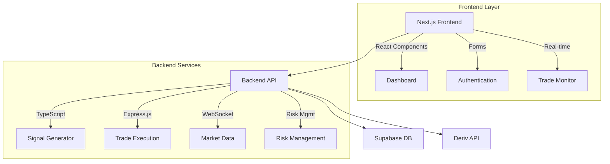

# Trading Bot System

A full-stack automated trading platform built with Next.js, Express.js, and Deriv API integration for VIX 10/25 index trading.

## 🏗️ System Architecture



## ✨ Features

### Frontend (Next.js)
- **User Authentication** - Secure registration and login
- **Dashboard** - Real-time trading overview
- **Trade Management** - View active trades and history
- **Signal Display** - Live trading signals and analytics
- **Settings Configuration** - Bot parameters and risk management

### Backend (Express + TypeScript)
- **Authentication** - Supabase-integrated user management
- **Signal Generation** - Price Action + Supply/Demand analysis
- **Trade Execution** - Deriv API integration
- **Market Data** - Real-time VIX 10/25 index data (15m candles)
- **Risk Management** - Automated position sizing and stop-loss
- **Logging** - Comprehensive trade history and audit trails

## 🛠️ Tech Stack

### Frontend
- **Next.js 14** - React framework with App Router
- **TypeScript** - Type-safe development
- **Tailwind CSS** - Modern UI styling
- **React Hook Form** - Form management
- **Chart.js** - Trading charts and analytics

### Backend
- **Express.js** - REST API server
- **TypeScript** - Type-safe Node.js development
- **Supabase** - PostgreSQL database & auth
- **WebSocket** - Real-time market data
- **Deriv API** - Trading execution

### Infrastructure
- **PostgreSQL** - Primary database (via Supabase)
- **Redis** - Caching and session storage
- **Docker** - Containerization
- **Vercel** - Frontend deployment
- **Railway/Render** - Backend deployment

## 🚀 Quick Start

### Prerequisites
- Node.js 18+ 
- PostgreSQL database
- Deriv trading account
- Supabase account

### Installation

1. **Clone the repository**
```bash
git clone <repository-url>
cd trading-bot-system
```

2. **Frontend Setup**
```bash
cd frontend
npm install
cp .env.example .env.local
# Configure environment variables
npm run dev
```

3. **Backend Setup**
```bash
cd backend
npm install
cp .env.example .env
# Configure environment variables
npm run dev
```

### Environment Variables

**Frontend (.env.local)**
```env
NEXT_PUBLIC_SUPABASE_URL=your_supabase_url
NEXT_PUBLIC_SUPABASE_ANON_KEY=your_supabase_anon_key
NEXT_PUBLIC_API_URL=your_backend_url
```

**Backend (.env)**
```env
DATABASE_URL=your_supabase_db_url
DERIV_APP_ID=your_deriv_app_id
JWT_SECRET=your_jwt_secret
REDIS_URL=your_redis_url
```

## 📊 Trading Strategy

### Market: VIX 10/25 Index
- **Timeframe**: 15-minute candles
- **Trading Hours**: 24/5
- **Strategy**: Price Action + Supply/Demand zones

### Signal Generation
1. **Price Action Analysis**
   - Support/Resistance levels
   - Candlestick patterns
   - Trend identification

2. **Supply/Demand Zones**
   - Zone identification and validation
   - Volume analysis
   - Breakout confirmation

3. **Risk Management**
   - Dynamic position sizing
   - Stop-loss and take-profit levels
   - Maximum drawdown limits

## 🔐 Security Features

- **JWT Authentication** - Secure user sessions
- **API Key Encryption** - Secure Deriv credentials storage
- **Input Validation** - Comprehensive request sanitization
- **Rate Limiting** - API abuse prevention
- **CORS Configuration** - Cross-origin security

## 📈 Monitoring & Logging

### Real-time Monitoring
- Trade execution logs
- Signal generation events
- System performance metrics
- Error tracking and alerts

### Analytics
- Performance dashboards
- Profit/loss tracking
- Win rate analysis
- Risk exposure monitoring

## 🗄️ Database Schema

### Core Tables
- `users` - User accounts and preferences
- `trades` - Trade execution history
- `signals` - Generated trading signals
- `sessions` - User authentication sessions
- `settings` - Bot configuration per user

## 🔄 API Endpoints

### Authentication
- `POST /api/auth/register` - User registration
- `POST /api/auth/login` - User login
- `POST /api/auth/logout` - User logout

### Trading
- `POST /api/trades/execute` - Execute trade
- `GET /api/trades/history` - Trade history
- `GET /api/trades/active` - Active positions

### Signals
- `GET /api/signals/latest` - Latest signals
- `GET /api/signals/history` - Signal history

### Settings
- `GET /api/settings` - User bot settings
- `PUT /api/settings` - Update bot settings

## 🐳 Deployment

### Docker Deployment
```bash
docker-compose up -d
```

### Manual Deployment
1. Build frontend: `npm run build`
2. Start backend: `npm start`
3. Configure reverse proxy (nginx)

## 🤝 Contributing

1. Fork the repository
2. Create feature branch: `git checkout -b feature/amazing-feature`
3. Commit changes: `git commit -m 'Add amazing feature'`
4. Push to branch: `git push origin feature/amazing-feature`
5. Open Pull Request

## 📝 License

This project is licensed under the MIT License - see the [LICENSE](LICENSE) file for details.

## ⚠️ Risk Disclaimer

Trading financial instruments carries significant risk. This software is for educational purposes only. Past performance does not guarantee future results. Users are solely responsible for any trading decisions and should consult with qualified financial advisors before engaging in trading activities.

## 🆘 Support

For technical support or questions:
- Create an issue on GitHub
- Check documentation in `/docs`
- Join our Discord community

---

**Built with ❤️ for the trading community**